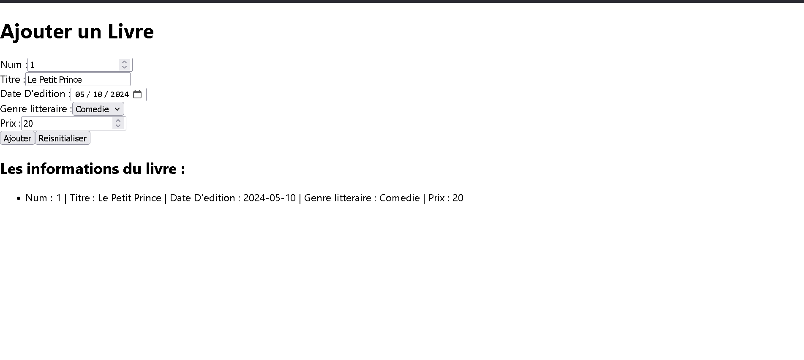

# Livre Manager

Une application React permettant d'ajouter, gérer et afficher une liste de livres, avec un formulaire complet et une validation des données.

## Fonctionnalités

- Formulaire d'ajout de livre avec les champs suivants :
  - **Num** : numéro/identifiant du livre
  - **Titre** : titre de l'ouvrage
  - **Date d'édition** : date de publication
  - **Genre littéraire** : sélection parmi une liste déroulante (ex : Comédie, Roman, Poésie...)
  - **Prix** : prix du livre
- Bouton **Ajouter** pour enregistrer un nouveau livre
- Bouton **Réinitialiser** pour vider le formulaire
- Affichage dynamique de la liste des livres ajoutés sous forme de liste

## Aperçu



> Ajoutez une capture d'écran du projet dans le dossier racine sous le nom `./public/Livre.png` pour qu'elle s'affiche ici.

## Technologies utilisées

- [React JS](https://react.dev/) (créé avec Create React App)
- JavaScript (ES6+)
- CSS

## Installation et lancement

1. Cloner le dépôt :

   ```bash
   git clone https://github.com/<ton-nom-utilisateur>/livre-manager.git
   cd livre-manager
   ```

2. Installer les dépendances :

   ```bash
   npm install
   ```

3. Lancer l'application en mode développement :

   ```bash
   npm start
   ```

4. Ouvrir [http://localhost:3000](http://localhost:3000) dans le navigateur.

## Structure du projet

```
livre-manager/
├── public/
│   └── index.html
├── src/
│   ├── AjouteLivre.js     # Composant du formulaire d'ajout de livre
│   ├── App.js             # Composant principal
│   ├── App.css            # Styles du composant principal
│   ├── index.js           # Point d'entrée de l'application
│   ├── index.css          # Styles globaux
│   ├── reportWebVitals.js
│   └── setupTests.js
├── .gitignore
├── package.json
└── README.md
```

## Améliorations possibles

- Persistance des données (localStorage ou backend)
- Modification et suppression d'un livre existant
- Validation plus poussée des champs (dates, prix négatifs, etc.)
- Tri et recherche dans la liste des livres

## Auteur

Développé par **Derrick Teddy Wongbay** — développeur web full-stack.

## Licence

Ce projet est distribué sous licence MIT. Voir le fichier [LICENSE](./LICENSE) pour plus de détails.
